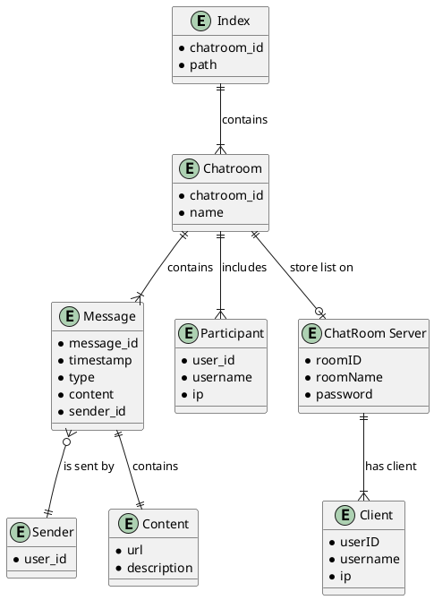

# null

## 逻辑模型

仅表示关系，我不知道具体一对多什么的怎么画



## 物理模型

### Client

```json
eg: index.json
{
  "chatrooms": [
  {
    "chatroom_id": "chatroom-1234",
    "path": "~/.cache/chatroom-1234.json"

  },{
    "chatroom_id": "chatroom-foo",
    "path": "~/.cache/chatroom-foo.json"
  }
  ]
}
```

```json
eg: chatroom-1234.json
{
  "chatroom": {
    "name": "Global Chatroom",
    "messages": [
      {
        "message_id": 0,
        "timestamp": "2024-05-09T10:30:00Z",
        "sender": {
          "user_id": "user-1001",
        },
        "type": "text",
        "content": "Hello everyone!"
      },
      {
        "message_id": 1,
        "timestamp": "2024-05-09T10:35:00Z",
        "sender": {
          "user_id": "user-1003",
        },
        "type": "video",
        "content": {
          "url": "https://example.com/video123.mp4",
          "description": "A short video clip"
        }
      },
      {
        "message_id": 2
        "timestamp": "2024-05-09T10:40:00Z",
        "sender": {
          "user_id": "user-1004",
        },
        "type": "audio",
        "content": {
          "url": "file:///home/.foo/bar.flac",
          "description": "An local store file"
        }
      }
    ]
  }
}
```

多媒体文件通过 url 表示, 可以为本地路径

```json
eg: chatroom-1234-members.json
{
    "participants": [
      {
        "user_id": "user-1001",
        "username": "Alice",
        "ip": "192.168.1.10"
      },
      {
        "user_id": "user-1002",
        "username": "Bob",
        "ip": "192.168.1.11"
      },
      {
        "user_id": "user-1003",
        "username": "Charlie",
        "ip": "192.168.1.12"
      },
      {
        "user_id": "user-1004",
        "username": "David",
        "ip": "192.168.1.13"
      }
    ]
}
```

### Server

server 端数据结构由于不需要持久化存储，固直接给出 C++ 类定义

```cpp
struct Client{
  size_t userID;
  std::string username;
  std::string ip;
  std::list<std::string> joinedRooms;
};

struct ChatRoom{
  size_t romeID;
  std::string roomName;
  std::string password;
  std::list<std::shared_ptr<Client>> users;
  std::list<std::string> blacklist;
};

std::unordered_map<size_t, std::shared_ptr<Client>> clients; // 维护在线客户端
std::unordered_map<std::string, ChatRoom> chatrooms; // 维护在线房间
```

