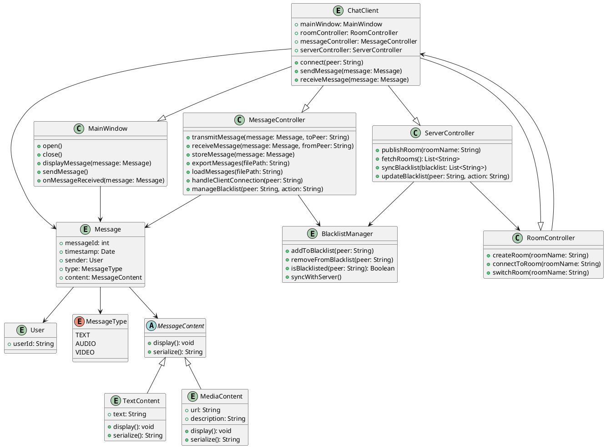
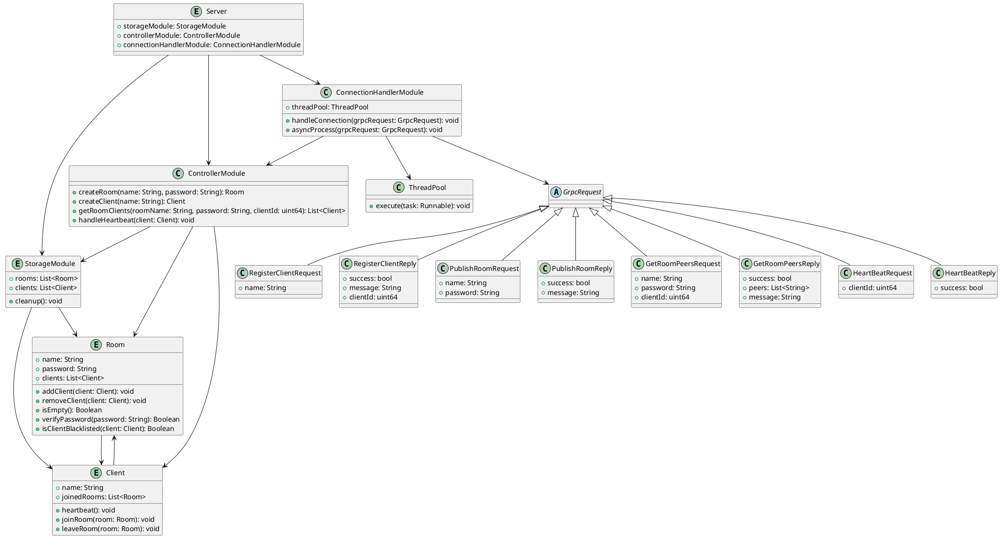
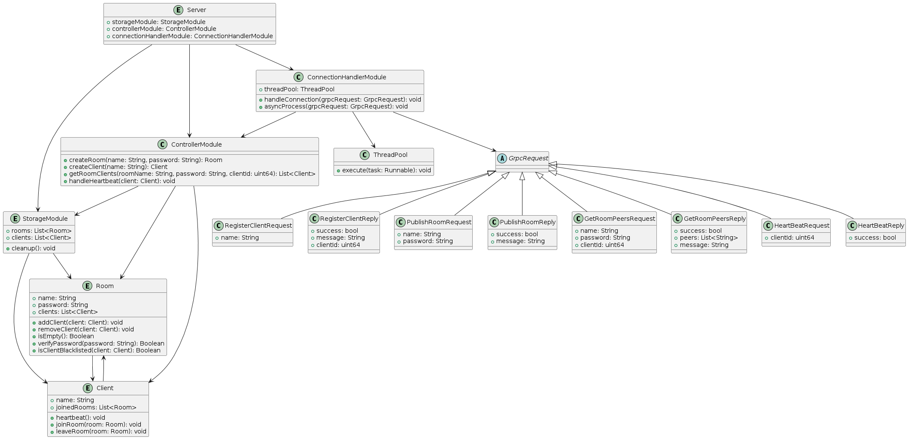

# UML
设计思路 [procedure](https://chatgpt.com/share/c20d6e9e-6020-4498-91e8-470a2cbb2a5a)

uml是干什么的，是分享思路的，你设计阶段画个草图人能看懂就行了。但是我猜你一堆b事，那就ai吧。还有UML你那一堆b符号有什么大病，多写点注释会死是把，喜欢虚实结合和不同形状箭头，你怎么不去用道尔顿元素符号呢😅😓😇
## Client

For github(which can't render plantuml): 
## Server

For github(which can't render plantuml): 

