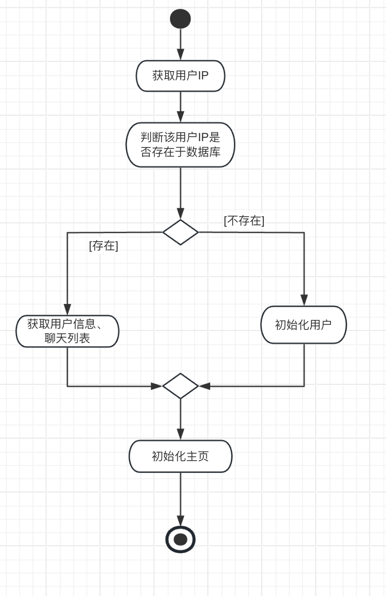
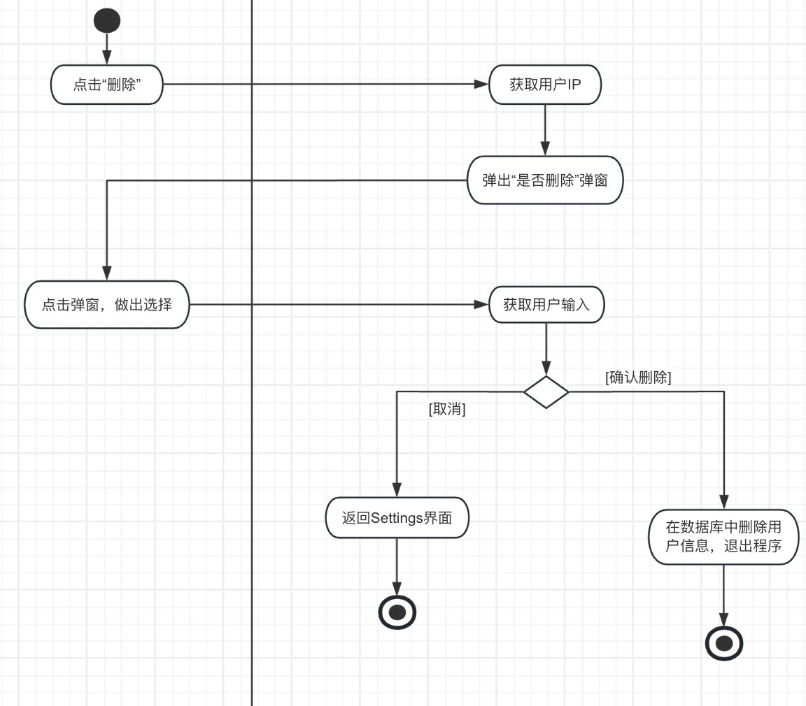
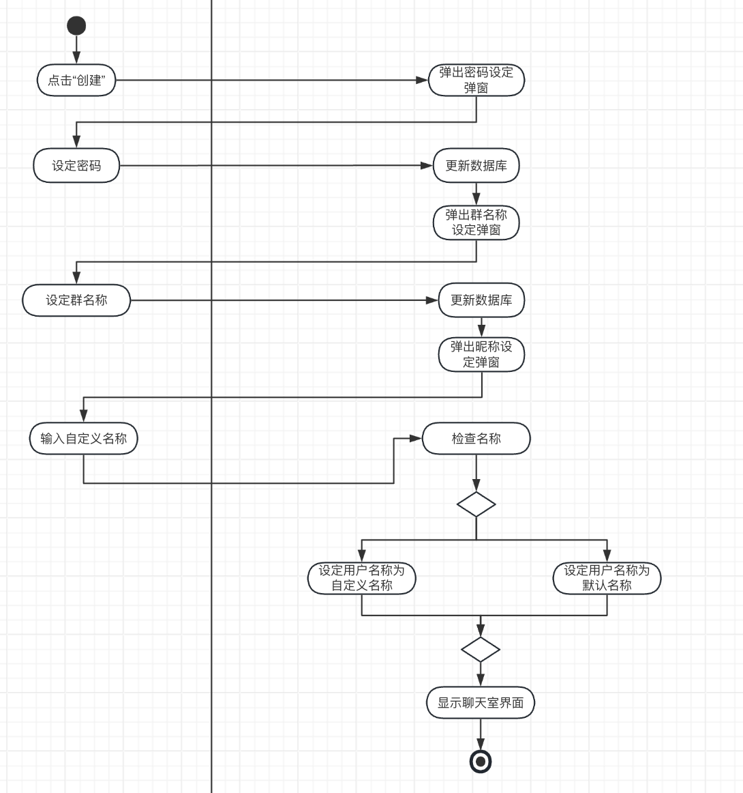
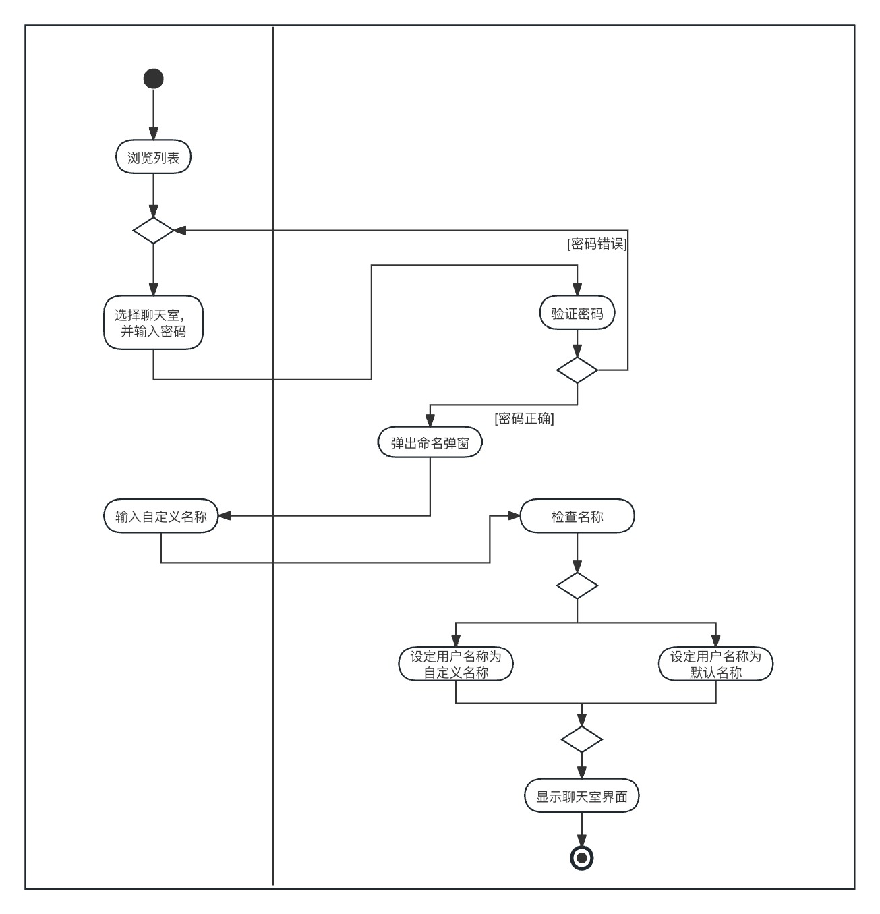

# 产品功能设计报告（第一次报告）

**项目名称**：Telegram chatting Room

**摘要**：本文档系统阐述使一台Windows客户端实现一个网络聊天室的开发过程。首先介绍了网络聊天室的基本功能需求，包括用户登录、创建/加入聊天室、消息发送接收等功能。接着详细介绍了在开发过程中所遇到的设计约束条件，如安全性、稳定性、扩展性等方面的考虑。最后，本文档作为将来测试和验收的标准，对网络聊天室的功能完整性、性能表现、用户体验等方面提出了具体要求和评估标准。

**相关文档**：

**版权所有**：相信光的CS209 group2

**修改记录**：

|  日期   | 版本 |         说明         |                 作者                 |
| :-----: | :--: | :------------------: | :----------------------------------: |
| 4月12日 | V1.0 | 初版产品功能设计设想 |         相信光的CS209 group2         |
| 4月13日 | V1.5 |    框架内容的补全    | 痛恨乱闯学校的人类幼崽的CS209 group2 |
| 4月14日 | V1.5.1| adding activity diagrams(3.1-3.2)|     CS209 group2 GanLiu           |
| 4月15日 | V1.5.2| adding activity diagrams(3.3)    |     CS209 group2 Tian             |
|         |      |                      |                                      |

## 目录

[TOC]

## 1.简介

这是一个基于局域网的聊天室客户端，用于连接同一个局域网内的独立IP用户，通过创建聊天室进行信息的交互，包括文本，图像，视频。

### 1.1目的

本文档旨在为《局域网聊天室客户端》提供详细的设计规范。它将涵盖软件在设计和开发过程中所需实现的功能、业务逻辑、用户界面设计、以及系统架构等方面的内容。目的是确保开发团队对项目的需求和目标有清晰的认识，从而保证软件的质量和开发进度。

### 1.2范围

本文档包含了《局域网聊天室客户端》的全面设计要求，**也许不**包括但不限于软件的功能需求、非功能需求、界面设计、系统架构设计、数据库设计、通信协议、安全性考虑、性能指标、以及测试策略。此外，它还将详细说明通信组件和检查组件的开发内容，包括它们的实现方式、接口定义和验证方法。本文档适用于项目开发团队、项目经理、测试人员以及其他相关利益相关者。

### 1.3参考资料

​        由于我们准备赋予该软件较为高度的现实使用意义，所以我们在功能开发，UI设计等方面均参考了现如今体量巨大的聊天软件，例如腾讯QQ和Telegram。可以说在功能设计方面，与以上两款软件高度重合，由于仅作为教育意义而开发，所以无抄袭之意，仅作为参考。

## 2.开发背景

​       仅作为南方科技大学CS209课程小组合作项目开发，将“Telegram chatting Room”作为一款跳出Java框架外的mini客户端设计，采用cpp Qt作为开发框架，并严格按照工业界软件开发标准进行设计的一款局域网聊天软件。其中涉及到局域网IP连接，信息传输，数据库管理等内容。

## 3.技术业务需求

本系统主要针对加入局域网内的用户进行用户操作实例展示

给出如下实例图

### 3.1.用户账户管理

#### 3.1.1.用户登录

数据流图：

*业务流程：

1. 在用户打开该软件后，系统读取用户的本机IP。
2. 系统扫描并检查当前数据库中是否存在有这一IP。
3. 系统查找到IP后，系统获取用户信息及对应聊天室列表。
4. 如果当前数据库内还没存在有该IP，则将当前IP存储进数据库，随后进入系统主页。

#### 3.1.2.用户账户注销

*业务流程：

1. 在“Setting”界面，用户可以将界面拉到最底部的“删除用户”并点击。

2. 系统将再次提示“是否删除”。

3. 当用户确认后，系统将删除用户的所有有关信息。

4. 若取消则返回“Setting”界面。
    

    

### 3.2.用户创建或者加入聊天室

#### 3.2.1.用户创建聊天室

*业务流程：

1. 用户可以点击主页内的“创建聊天室”。

2. 用户可以选择输入密码或者不设置密码。

3. 设置好密码后，会弹出一个小窗，用户被要求输入个人“昵称”和“聊天室名称”。

4. 如果昵称输入为空则初始化一个随机6位字符串。

5. 若聊天室名称输入为空，则初始化为“聊天室+房主IP”这一字符串。

6. 输入完毕后就进入到聊天室窗口内。
    

#### 3.2.2.用户加入聊天室

*业务流程：

1. 系统会维护一个“当前局域网内存在的聊天室”列表，用户可以选择任意一个点击。

2. 如果该房间有密码，则在下方输入密码。

3. 若没有密码或者密码验证成功，则跳出小窗要求用户输入“昵称”。

4. 如果昵称输入为空则初始化一个随机6位字符串。

5. 输入完毕后用户进入到聊天室界面。
    

### 3.3.聊天室内功能

#### 3.3.1.发送信息

*业务流程：

1. 在聊天室页面的中间有聊天输入框，用户可以在此输入文本或者表情。

2. 输入完毕后，用户可以点击右边的“确认”或者键盘输入“回车”即可发送内容到聊天室。

3. 用户还可以点击“文件发送”按键，之后会弹出一个小窗，。

4. 用户可以在这个小窗内上传“图片，音频，视频”这三种类型的文件进行发送。

    
    

#### 3.3.2.投票踢出用户

*业务流程：

1. 所有用户都可以使用聊天室的“投票踢出”功能。

2. 右键除自己之外的用户，会弹出窗口询问是否发起移出用户投票。

3. 之后系统会开启一个投票功能，其他用户可以选择“赞成/反对”。

4. 如果赞成数超过当前聊天室的半数用户以上即可将该用户从当前房间踢出。

   

#### 3.3.3.用户收藏信息

*业务流程：

1. 用户可以右键任意一条信息，然后会出现“收藏”选项。

2. 当用户收藏信息后，该条信息的内容会保存在该用户的本地文件内。

   

#### 3.3.4.退出群聊

*业务流程：

1. 当用户点击窗口的关闭按键后，会弹出一个小窗。
2. 小窗会显示两个选项“确认”或“取消”。
3. 若选择“取消”按键，则关闭窗口返回聊天室界面。
4. 若选择“确定”按键，则视为该用户退出聊天室并关闭页面。

    

## 4.产品功能设计

### 4.1创建或加入聊天室界面

该界面为聊天室初始界面，包含两个选项：加入聊天室和创建聊天室。

#### 4.1.1创建聊天室

点击创建聊天室，弹出该界面，在输入栏中输入密码和昵称，若空则随机初始化字符串。点击按钮后进入聊天室界面。

#### 4.1.2加入聊天室

界面存在滚动列表，显示出当前局域网下所有聊天室。可选中某一聊天室，弹出该界面，在输入栏中输入密码和昵称，若空则随机初始化字符串。点击按钮后进入聊天室界面。

### 4.2聊天室界面

聊天室界面仿照主流社交软件设计。

#### 4.2.1聊天室主界面

主要包括聊天室名称，内容显示框，输入栏，成员列表，退出按钮。

聊天室名称为所有成员均可修改。

内容显示框中由自己发送的消息显示于右侧，他人发送的消息显示于左侧，每一条消息上方显示发送者昵称。

输入栏中可以输入发送文字和表情包，也可以点击输入栏上方的图标选择发送图片，音频文件等文件。

成员列表可滚动显示该聊天室所有成员的名单。

点击退出按钮可退出并关闭聊天室界面。

#### 4.2.2修改昵称窗口

点击自己的昵称会出现修改昵称窗口，可以输入新昵称。

#### 4.2.3投票移出用户窗口

##### 4.2.3.1发起投票窗口

点击其他用户昵称会出现发起移出用户窗口，可选择发起或者取消。

##### 4.2.3.2投票窗口

在某一用户发起投票后，会对全体用户弹出该窗口，必须选择赞成或者反对。

